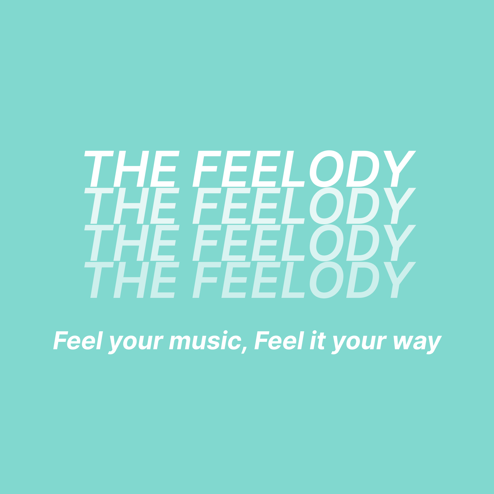
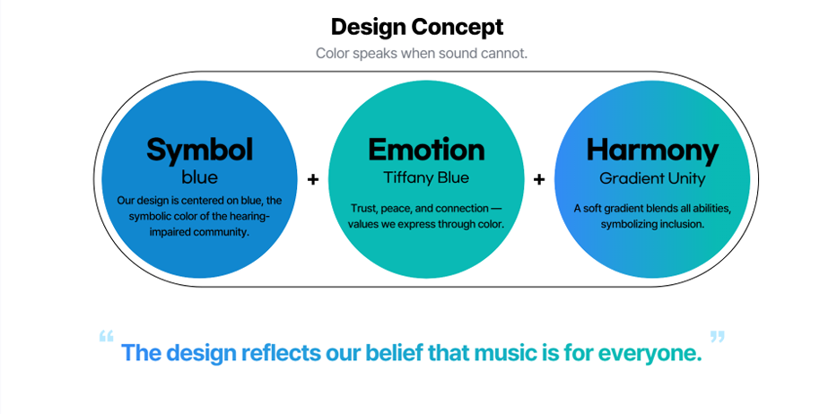
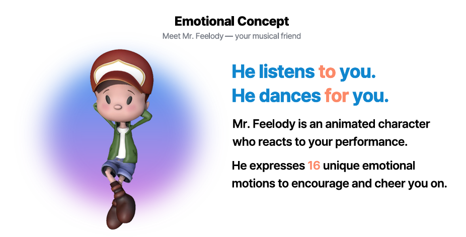
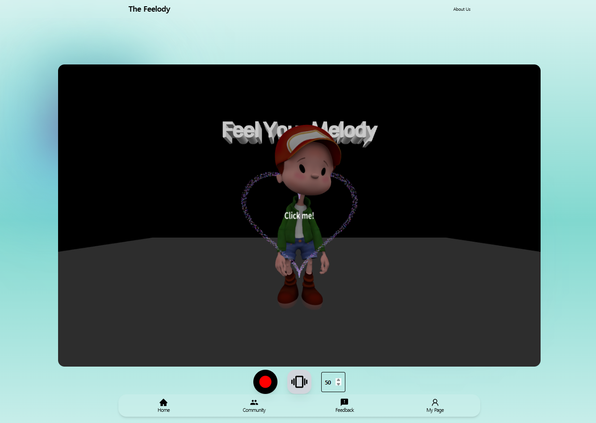
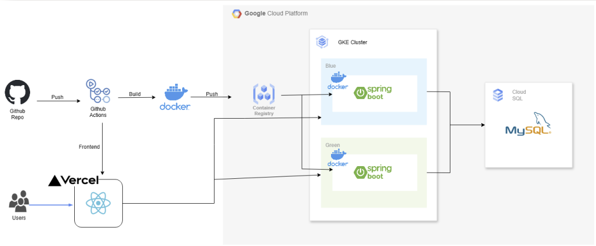
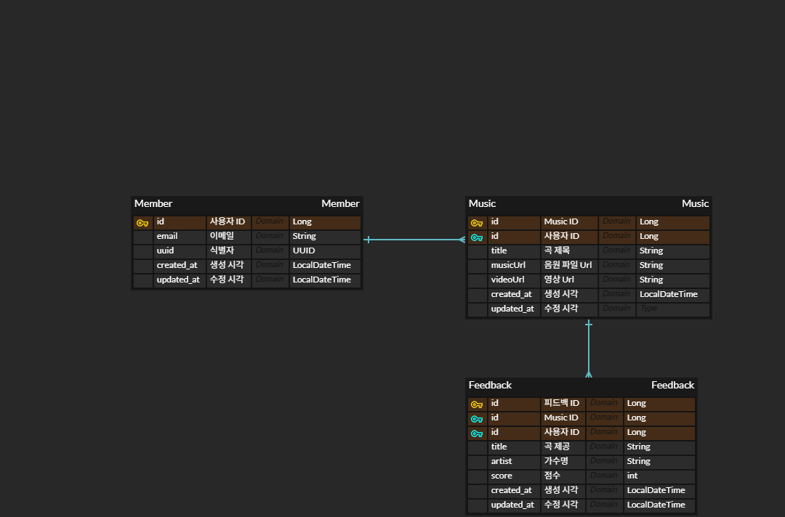

  

# 
 🎵 Feelody  - Feel your melody
###  
 _Our service will be a bridge between silence and musical self-expression_
####  
 🔗 [🌐 Try Feelody Web App Live](https://4th-sc-team-6-fe.vercel.app/)

  
# 
 🎶 Overview
**Feelody** is an assistive web service that helps hearing-impaired users enjoy music through **visual and tactile feedback**.

By converting **pitch** and **rhythm** into animated visuals and wrist vibrations, users can **feel their own musical expression — in real time**.

This tool bridges the gap between **hearing and feeling**, enabling true musical participation.

  

##  
 🌐 Theme

  <h3>Innovate for Wellness</h3>

  

  

    Create solutions that improve access to care and enhance patient outcomes.
  

  

## 
 🌈 Feelody Identity: Design & Emotion

  

  

  

##  
 ⭐ Key Features

  

-  **Real-time Pitch & Rhythm Feedback**  
  Visualize your performance with a color-coded waveform and real-time metronome.

-  **Mr. Feelody's Emotional Reactions**  
  16 expressive animations respond to your musical accuracy, providing motivation and fun.

-  **Smartwatch Vibration Sync**  
  Feel the beat through synchronized wrist vibrations for better rhythm awareness.

-  **Performance Replay & AI Scoring**  
  Replay your practice sessions and receive scores powered by Gemini AI.

-  **Interactive Community Feedback**  
  Share your performances and receive encouragement through user comments.
  

#  
 🛠️ Architecture

  

#### 1. Code Push
Developers push code to the GitHub repository.

#### 2. CI with GitHub Actions
GitHub Actions automatically build Docker images for the Spring Boot backend.

#### 3. Push to Google Container Registry
The Docker images are pushed to GCP's Container Registry.

#### 4. Backend Deployment to GKE
Images are deployed to a GKE (Google Kubernetes Engine) cluster.  
Blue-Green deployment strategy is used to ensure smooth rollouts and zero downtime.

#### 5. Database Connection
The Spring Boot backend connects to Cloud SQL (MySQL) for data management.

#### 6. Frontend Deployment to Vercel
The React frontend is deployed separately via Vercel, providing fast and optimized delivery to end-users.
  
  

# 
  🗂️ ERD Diagram

  

  

# 
  ⚙️ Tech Stacks

####  Backend
          

####  Database
    

####  CI/CD
   

#### Infra / Deploy
    

#### Frontend & Build
         

####  Routing & Styling
   

####  HTTP Client
   

####  AI
   

  

> ### Even without sound, music can be felt.  
 

## 
 👥 Team Members

  

| **👑진현지** | **이창목** | **고동수** | **장우석** |
| :------: | :------: | :------: | :------: |
| [ @Catsmanager Frontend](https://github.com/Catsmanager) | [ @eelkom Frontend](https://github.com/eelkom) | [ @kdongsu5509 Backend](https://github.com/kdongsu5509) | [ @us4c0d3 Backend](https://github.com/us4c0d3) |

